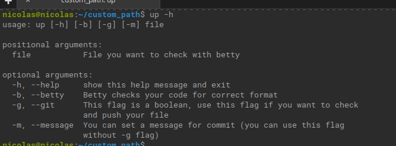

# holbertonscript
This is a script that i wrote in Python for agilize the betty check and the push to github, only using one command


## Files
   **Content of this repo**    
| **File** | **Decription**|
|----------|---------------|
| img | Folder that contains the .png of the script |
| 5-rev_string.c | File betty test |
| script.py | Main code of the software |

## Requirements
You need to install those programs in you Virtual Machine, main OS or in virtualenv for the software runs.

* Python3
* termcolor // Termcolor install automatically in your machine if not exist in the system

## How to install
First, if you are on linux. You need to open a new terminal and go to the folder repository and copy all the content from script, to a empty file named: up
then, give the 'up' file execution permisson and add that file into your linux PATH

```
cat script.py > up
...
chmod +x up
```
Once you add the up file into your PATH, you can use it with the command: up, in your terminal

## How to use it?
in your terminal, type
```
~$ up -h
usage: up [-h] [-b] [-g] [-m] file

positional arguments:
  file           File you want to check with betty

optional arguments:
  -h, --help     show this help message and exit
  -b, --betty    Betty checks your code for correct format
  -g, --git      This flag is a boolean, use this flag if you want to check
                 and push your file
  -m, --message  You can set a message for commit (you can use this flag
                 without -g flag)
```

the flag -h shows you the help of the command
the flag -b is for check betty only
the flag -g is for push your code to github (you need to use the flag -m to add a commit message, the message need to inside " ")
if you use this command without flags, checks betty first and then, if you agree with betty, push the changes to the remote repository
```
~$ up name_of_file.c

initializing push process

========== 5-rev_string.c ==========
rev_string
Betty is ok? Y/n: Y
En la rama master
Tu rama está actualizada con 'origin/master'.

nada para hacer commit, el árbol de trabajo está limpio
Insert message (if you dont put any message, by default, the commit message will be 'commit'): "test commit"
Message "test commit" saved!
[master c036129] test commit
 1 file changed, 1 insertion(+), 1 deletion(-)
Contando objetos: 3, listo.
Delta compression using up to 8 threads.
Comprimiendo objetos: 100% (3/3), listo.
Escribiendo objetos: 100% (3/3), 291 bytes | 291.00 KiB/s, listo.
Total 3 (delta 2), reused 0 (delta 0)
remote: Resolving deltas: 100% (2/2), completed with 2 local objects.
To https://github.com/nikolasribeiro/holbertonscript
   e87f9fd..c036129  master -> master
Push process finished successfully!

```

### Author
*Nicolas Ribeiro* - [Github](https://github.com/nikolasribeiro) || [Linkedin](https://www.linkedin.com/in/nicolas-sebastian-ribeiro/) || [Email](nikolas.sebastian.ribeiro@gmail.com)
